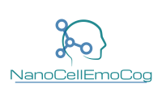

&NewLine;
&NewLine;

***

  {width=40%}

&NewLine;

***
**Naziv projekta:** Neuroimmune aspects of mood, anxiety and
cognitive effects of leads/drug candidates acting at
GABAA and/or $\sigma2$ receptors: In vitro/in vivo
delineation by nano- and hiPSC-based platforms

&NewLine;

**Akronim:** NanoCellEmoCog

**NanoCellEmoCog** je projekat iz oblasti (bio)medicinskih nauka. Glavni cilj projekta je da se testira hipoteza da farmakokinetički optimizovana modulacija GABAA i $\sigma2$ receptora zasnovana na nanonosačima, sama ili u kombinaciji, dovodi do značajnih poboljšanja neuroimunih i/ili bihejvioralnih rezultata dobijenih kroz *in vitro* i *in vivo* sisteme napravljene da oponašaju kompromitovani neuroimuni status, koji se nalazi u osnovi različitih poremećaja centralnog nervnog sistema, a koji utiču na raspoloženje, uzrokuju anksioznost i kognitivne poremećaje.

&NewLine;
&NewLine;
&NewLine;

**Finansiranje:** Projekat je finansiran od strane Fonda za nauku Republike Srbije, u okviru projektnog poziva IDEJE. Projekat se realizuje na Farmaceutskom fakultetu, Univerziteta u Beogradu. 

***

 &nbsp; &nbsp; &nbsp; 
 &nbsp; &nbsp; &nbsp; 
 

