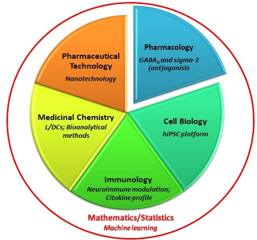

***
Svi istraživači su deo iste naučno-istraživačke organizacije – Farmaceutskog fakulteta Univerziteta u Beogradu. Istraživački tim projekta NanoCellEmoCog čini 14 visoko motivisanih istraživača, različitih zvanja, iskustava i kompetencija: 5 istraživača sa Katedre za farmakologiju, 6 istraživača sa Katedre za farmaceutsku tehnologiju i kozmetologiju, 2 istraživača sa Katedre za mikrobiologiju i imunologiju,  i  po 1 istraživač sa Katedri za organsku hemiju, odnosno fiziku i matematiku.

&NewLine; 

<table border="0">
 <tr>
    <td><b style="font-size:30px"> </b></td>
    <td><b style="font-size:30px"> </b></td>
 </tr>
 <tr>
    <td>
     
      - [Prof. dr Miroslav Savić](http://pharmacy.bg.ac.rs/o-fakultetu/redovni-profesori/1690/dr-sc-miroslav-savi%C4%87/) - rukovodilac projekta  
      - [Prof. dr Snežana Savić](http://pharmacy.bg.ac.rs/o-fakultetu/redovni-profesori/651/dr-sc-sne%C5%BEana-savi%C4%87/)  
      - [Prof. dr Biljana Bufan](http://pharmacy.bg.ac.rs/o-fakultetu/vanredni-profesori/286/dr-sc-biljana-bufan/)  
      - [Doc. dr Ivan Jančić](http://pharmacy.bg.ac.rs/o-fakultetu/docenti/771/dr-sc-ivan-jan%C4%8Di%C4%87/)  
      - [Prof. dr Ivana Pantelić](http://pharmacy.bg.ac.rs/o-fakultetu/vanredni-profesori/1251/dr-sc-ivana-panteli%C4%87/)  
      - [Branka Divović Matović](http://pharmacy.bg.ac.rs/o-fakultetu/asistenti/2698/mag-farm-branka-divovi%C4%87-matovi%C4%87/)  
      - [Miloš Jovanović](http://pharmacy.bg.ac.rs/o-fakultetu/asistenti/4896/dr-sc-milo%C5%A1-jovanovi%C4%87-/)  
      - [Aleksandra Kovačević](http://pharmacy.bg.ac.rs/o-fakultetu/asistenti/4705/mag-farm-aleksandra-kova%C4%8Devi%C4%87/)  
      - dr Jovana Aranđelović  
      - [dr Tanja Ilić](http://pharmacy.bg.ac.rs/o-fakultetu/asistenti/4113/dipl-farm-tanja-ili%C4%87/)  
      - [dr Ines Nikolić](http://pharmacy.bg.ac.rs/o-fakultetu/asistenti/4111/mag-farm-ines-nikoli%C4%87/)  
      - [Danijela Milenković](http://pharmacy.bg.ac.rs/o-fakultetu/asistenti/2701/danijela-milenkovi%C4%87/)  
      - [Jelena Mitrović](http://pharmacy.bg.ac.rs/o-fakultetu/asistenti/5713/mag-farm-jelena-mitrovi%C4%87/)  
      - [Jelena Đoković](http://pharmacy.bg.ac.rs/o-fakultetu/asistenti/2916/mag-farm-jelena-%C4%91okovi%C4%87/)  
    </td>
    <td align="right">{width=70%}</td>
 </tr>
</table>

